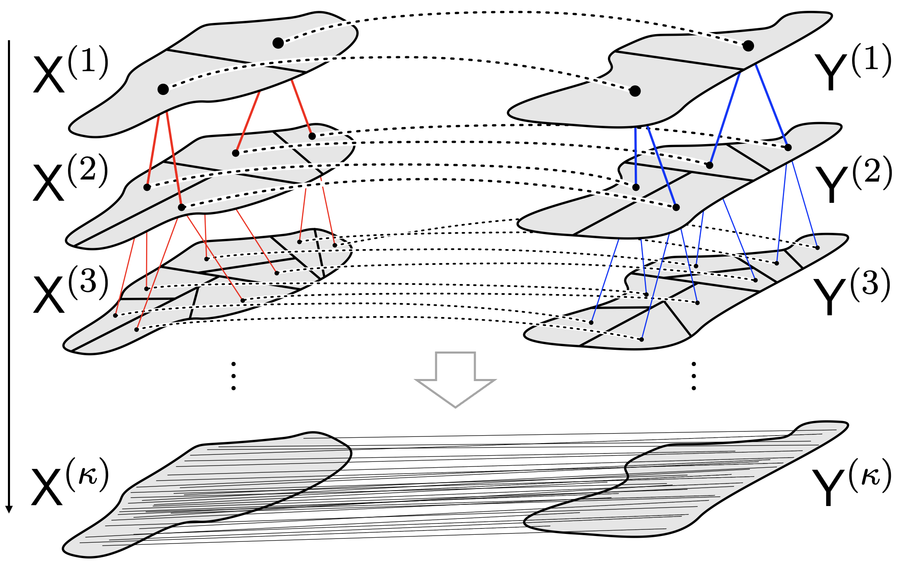
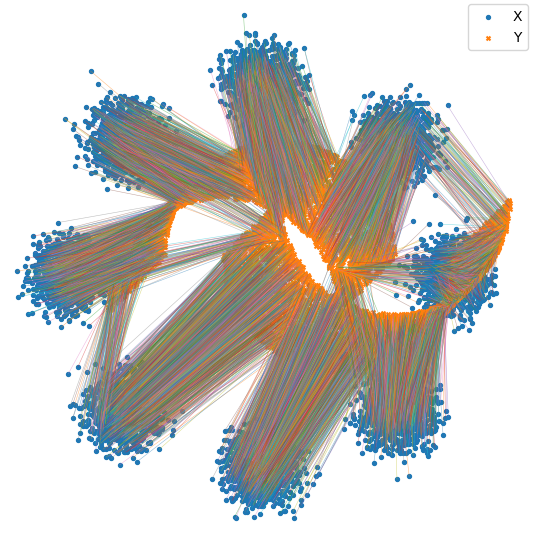

# Hierarchical Refinement (HiRef)

This is a JAX Adaptation of **["Hierarchical Refinement: Optimal Transport to Infinity and Beyond,"](https://openreview.net/forum?id=EBNgREMoVD)** (ICML 2025) which scales optimal transport **linearly in space** and **log-linearly in time** by using a hierarchical strategy that constructs multiscale partitions from low-rank optimal transport.

In the section below, we detail the usage of Hierarchical Refinement which complements the simple example notebook:
```markdown
- [HiRef_Demo.ipynb](HiRef_Demo.ipynb.ipynb)
```



*Figure 1: Hierarchical Refinement algorithm: low-rank optimal transport is used to progressively refine partitions at the previous scale, with the coarsest scale partitions denoted* $X^{(1)}, Y^{(1)}$ *, and the finest scale partitions* $X^{(\kappa)}, Y^{(\kappa)}$ *corresponding to the individual points in the datasets.*


*Figure 1: Example Alignment on 2 Moons 8 Gaussians Dataset
---

## **Usage**

**Hierarchical Refinement (HiRef)** only requires two **n×d** dimensional point clouds `X` and `Y` (**torch tensors**) as input.

Before running HiRef, call the **rank-annealing scheduler** to find a sequence of ranks that **minimizes the number of calls** to the low-rank optimal transport subroutine while remaining under a machine-specific maximal rank.

### **Rank Scheduler Parameters**
- `n` : The size of the dataset
- `hierarchy_depth (κ)` : The depth of the hierarchy of levels used in the refinement strategy
- `max_Q` : The maximal terminal rank at the base case
- `max_rank` : The maximal rank of the intermediate sub-problems

---

## **Getting Started**

### **1. Compute the Optimal Rank Schedule**
Import the **rank annealing** module and compute the rank schedule:

```python
import rank_annealing

rank_schedule = rank_annealing.optimal_rank_schedule(
    n=n, hierarchy_depth=hierarchy_depth, max_Q=max_Q, max_rank=max_rank
)
```

### **2. Run Hierarchical Refinement**
Run and return paired tuples from `X` and `Y` (the bijective Monge assignment between the datasets):

```python
import src.HiRef as HiRef

frontier = HiRef.hiref_lr(X, Y, rank_schedule=rank_schedule,
                    base_rank=1,
                    iters_per_level = 100,
                    gamma=40.0,
                    rescale_cost=False,
                    return_coupling=False)
```
Or, alternatively:
```python
import src.HiRef_fast as HiRef

frontier = HiRef..hiref_lr_fast(X, Y, rank_schedule=rank_schedule,
                    base_rank=1,
                    iters_per_level = 100,
                    gamma=40.0,
                    rescale_cost=False,
                    return_coupling=False)
```

### **3. Compute the OT primal cost**
To compute the Optimal Transport (OT) cost, simply call:
```python
cost = HiRef.compute_ot_cost(frontier, X, Y, C=None, sq_euclidean=True)
```

## Contact

For questions, discussions, or collaboration inquiries, feel free to reach out at [ph3641@princeton.edu](mailto:ph3641@princeton.edu) or [jg7090@princeton.edu](mailto:jg7090@princeton.edu).

## Citation

If you found Hierarchical Refinement to be useful in your work, feel free to cite the paper:

```bibtex
@inproceedings{
    halmos2025hierarchical,
    title={Hierarchical Refinement: Optimal Transport to Infinity and Beyond},
    author={Peter Halmos and Julian Gold and Xinhao Liu and Benjamin Raphael},
    booktitle={Forty-second International Conference on Machine Learning},
    year={2025},
    url={https://openreview.net/forum?id=EBNgREMoVD}
}
```


